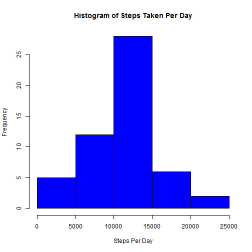

###Loading and preprocessing the data:


```r
activity <- read.csv("C:/Users/jmarkuna/Desktop/activity.csv")   #read in file
activity$date <- as.Date(activity$date,"%Y-%m-%d")  #turn 'date' column into Date class
```


###Question 1: What is the mean total number of steps taken per day?

####1) Calculate the total number of steps taken per day (values plotted in histogram below):


```r
rownum <- 1  #row counter
stepsday=c()   #vector containing steps taken per day
for (i in 1:61) {
  totalstep <- sum(activity[rownum:(rownum+287),1],na.rm=TRUE)   #sum steps taken in ith day
  if (totalstep >  0) {stepsday=c(stepsday,totalstep)}  #concatenate vector if steps taken were >0
  end
  rownum <- rownum+288  #increment counter to next day
}
```

####2) Make a histogram of the total number of steps taken each day:


```r
hist(stepsday, col ='blue',xlab="Steps Per Day",main="Histogram of Steps Taken Per Day") #print a histogram of steps per day
```

 

####3) Calculate and report the mean and median of the total number of steps taken per day:


```r
print(paste("The mean of steps per day is:", mean(stepsday)))
```

```
## [1] "The mean of steps per day is: 10766.1886792453"
```

```r
print(paste("The median of steps per day is:", median(stepsday)))
```

```
## [1] "The median of steps per day is: 10765"
```


###Question 2: What is the average daily activity pattern?

####1) Make a time series plot (i.e. type = "l") of the 5-minute interval (x-axis) and the average number of steps taken, averaged across all days (y-axis):


```r
stepvect <- c()  #vector to calculate mean for time interval
timeseries <-as.data.frame(matrix(c(0),nrow=288,ncol=2))  #create data frame to hold data
colnames(timeseries) <- c("interval", "avg_steps")
for (j in 1:288) {
  for (k in 1:61) {
    stepvect <- c(stepvect,activity[(j+288*(k-1)),1]) #create vector of steps taken at an interval
  }
  timeseries[j,1] <- activity[j,3]  #place interval into data frame
  timeseries[j,2] <- mean(stepvect,na.rm=TRUE)  #place mean steps into data frame
  stepvect <- c()   #reset for next loop
}
plot(timeseries$interval,timeseries$avg_steps,type="l",xlab="Interval",ylab="Average Steps", main="Average Steps vs. Interval", col ="red",lwd=2)
```

 

####2) Which 5-minute interval, on average across all the days in the dataset, contains the maximum number of steps:


```r
print(paste("The interval with the maximum average number of steps is:",timeseries[which.max(timeseries$avg_steps),1]))
```

```
## [1] "The interval with the maximum average number of steps is: 835"
```


###Question 3: Imputing missing values.

####1) Calculate and report the total number of missing values in the dataset (i.e. the total number of rows with NAs):


```r
print(paste("The number of NA values is:", sum(is.na(activity$steps))))    #prints number of NAs
```

```
## [1] "The number of NA values is: 2304"
```

####2) Devise a strategy for filling in all of the missing values in the dataset:

NAs appeared over the first eight days of taking data with the activity monitoring device. This data was imputed by replacing them with the mean of the associated 5-minute interval. This code is included in part 3 of this question.

####3) Create a new dataset that is equal to the original dataset but with the missing data filled in:


```r
activity$int_average <- timeseries[,2]    #puts averaage of each interval into 4th column
for (l in 1:17568) {
  if (is.na(activity[l,1]==TRUE)) {activity[l,1]=activity[l,4]    #Replace NAs with average interval value
  end  
  }
}
rownum <- 1  #row counter
stepsday=c()   #vector containing steps taken per day
for (i in 1:61) {
  totalstep <- sum(activity[rownum:(rownum+287),1],na.rm=TRUE)   #sum steps taken in ith day
  if (totalstep >  0) {stepsday=c(stepsday,totalstep)}  #concatenate vector if steps taken were >0
  end
  rownum <- rownum+288  #increment counter to next day
}
```

####4) Make a histogram of the total number of steps taken each day:


```r
hist(stepsday, col ='violet',xlab="Steps Per Day",main="Histogram of Steps Taken Per Day, Imputed") #print a histogram of steps per day
```

 

####Calculate and report the mean and median total number of steps taken per day:


```r
print(paste("The mean of steps per day is (with imputed data):", mean(stepsday)))
```

```
## [1] "The mean of steps per day is (with imputed data): 10766.1886792453"
```

```r
print(paste("The median of steps per day is (with imputed data):", median(stepsday)))
```

```
## [1] "The median of steps per day is (with imputed data): 10766.1886792453"
```


####Do these values differ from the estimates from the first part of the assignment? What is the impact of imputing missing data on the estimates of the total daily number of steps:

The mean value remained the same after imputing the data. This was the case because eight complete days of mean interval values were imputed to the dataset. An simple anology to this would be to calculate the mean of a set of numbers to be 5, add several more 5s to the set, and recalculate the mean.

The median value marginally increased from 10765 to 10766.2. This occured because eight complete days of mean data were imputed to the dataset, shifting the median to the mean value.


###Question 4: Are there differences in activity patterns between weekdays and weekends?

####1) Make a panel plot containing a time series plot (i.e. type = "l") of the 5-minute interval (x-axis) and the average number of steps taken, averaged across all weekday days or weekend days (y-axis). 


```r
activity$day <- sapply(1:17568,function(x) weekdays(activity[x,2]))  #produces day of the week from date
for (p in 1:17568) {
  if (activity[p,5] == "Saturday"|activity[p,5]== "Sunday") {
    activity[p,5] <- "Weekend"
  }
  else {activity[p,5] <- "Weekday"}
}
  
#Subset data frame into weekend and weekdays
weekday <- subset(activity,activity$day == "Weekday")
weekend <- subset(activity,activity$day=="Weekend")

par(mfrow=c(2,1)) #2 plots vertically aligned
#Weekday interval calculation (45 days)
stepvect <- c()  #vector to calculate mean for time interval
wdtimeseries <-as.data.frame(matrix(c(0),nrow=288,ncol=2))  #create data frame to hold data
colnames(wdtimeseries) <- c("interval", "avg_steps")
for (j in 1:288) {
  for (k in 1:45) {
    stepvect <- c(stepvect,weekday[(j+288*(k-1)),1]) #create vector of steps taken at an interval
  }
  wdtimeseries[j,1] <- weekday[j,3]  #place interval into data frame
  wdtimeseries[j,2] <- mean(stepvect,na.rm=TRUE)  #place mean steps into data frame
  stepvect <- c()   #reset for next loop
}
plot(wdtimeseries$interval,wdtimeseries$avg_steps,type="l",xlab="Interval",ylab="Average Steps", main="Average Steps vs. Interval, Weekdays", col ="red",lwd=2)

#Weekend interval calculation (16 days)
stepvect <- c()  #vector to calculate mean for time interval
wetimeseries <-as.data.frame(matrix(c(0),nrow=288,ncol=2))  #create data frame to hold data
colnames(wetimeseries) <- c("interval", "avg_steps")
for (j in 1:288) {
  for (k in 1:16) {
    stepvect <- c(stepvect,weekend[(j+288*(k-1)),1]) #create vector of steps taken at an interval
  }
  wetimeseries[j,1] <- weekend[j,3]  #place interval into data frame
  wetimeseries[j,2] <- mean(stepvect,na.rm=TRUE)  #place mean steps into data frame
  stepvect <- c()   #reset for next loop
}
plot(wetimeseries$interval,wetimeseries$avg_steps,type="l",xlab="Interval",ylab="Average Steps", main="Average Steps vs. Interval, Weekends", col ="red",lwd=2)
```

 


